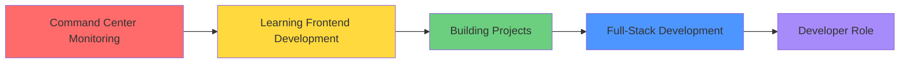

  <h1>👋 Hey, I'm Chandu Telagamsetti</h1>
  <h3>Aspiring Full-Stack Developer | Linux Enthusiast | Building in Public</h3>
  
  
  
  

---

## 🧠 About Me

- 🎓 Student exploring **Full-Stack Development** and **Cloud Technologies**
- 🌱 Currently building: Frontend projects using **HTML, CSS, JavaScript**
- 🔭 Next up: Learning **React.js** and **Node.js** to build full-stack applications
- 🐧 Linux user running projects on **Ubuntu VM** and exploring **Azure Cloud**
- 💼 Working towards: Transitioning from **Infrastructure/Monitoring → Development** roles
- 🎯 2026 Goal: Land my first developer role with a strong portfolio

---

## 🔥 What I'm Working On

- 🎨 Building responsive frontend projects from **Frontend Mentor**
- 🐧 Setting up development environment on **Linux VM**
- 💡 Planning: Personal portfolio website (coming soon!)

---

## 🚀 Featured Projects

📂 **[View all my projects →](https://github.com/ChanduTelaga?tab=repositories)**

---

## 🛠️ Tech Stack

### 💻 Languages & Frontend

### ☁️ Cloud & Infrastructure

### 🔧 Tools & Platforms

### 🎯 Currently Learning
- **Frontend Framework:** React.js (planned for 2025)
- **Backend:** Node.js, Express
- **Database:** SQL, MongoDB
- **DevOps:** Docker basics, CI/CD fundamentals

---

## 📊 GitHub Activity

  
  

  

---

## 🎯 Beyond Code

- 🎮 Enjoy solving coding challenges when I have time
- 📖 Reading: Tech blogs and development best practices
- 🎵 Code better with: Lo-fi beats and focus music
- 💭 Philosophy: "Learn by building, fail fast, iterate faster"
- ☕ Fun fact: I debug better after a cup of chai!

---

## 📈 My Learning Journey

**Current Stage:** Building Projects 🎨  
**Next Milestone:** NxtWave Full-Stack Program (Aug 2025)  
**End Goal:** Full-Stack Developer Role (2026)

---

## 📬 Let's Connect!

- 💼 LinkedIn: [chandutelagamsetti](https://www.linkedin.com/in/chandutelagamsetti/)
- 🐙 GitHub: [ChanduTelaga](https://github.com/ChanduTelaga)
- 📧 Email: [Drop me a message!](mailto:your.email@example.com)

  
  

---

  <i>⭐ If you find my projects interesting, consider giving them a star!</i>
   
  <i>💬 Always open to feedback and collaboration opportunities</i>

